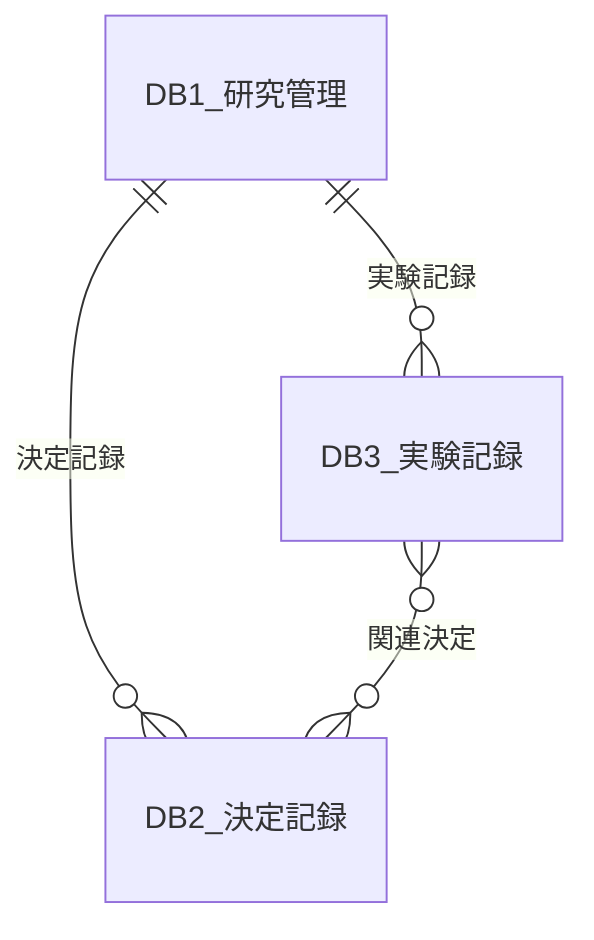

# Notion DB 設計書 — 研究ワークフロー管理

[← 返回总目录](../README.md)

> 作成日: 2026-07-29
> レビュー: Claude Sonnet 4.6 (Thinking)

---

## DB 構成

3 つのデータベースを Relation で接続する。

---

## DB1: 研究管理

プロジェクト全体の状態を管理する 1 レコードのマスター DB。

| フィールド | 型 | 備考 |
|:----------|:---|:------|
| プロジェクト | **Title** | プロジェクト名 |
| ステータス | **Select** | idle / discussing / executing / reviewing |
| 実行中 Stage | **Multi-select** | 00-orchestrator / 01 / 02 / 03 / 04 / 05 / 06 / 07 |
| サイクル | **Number** | 研究サイクル番号 |
| 実験数 | **Rollup → DB3** | DB3 のレコード数を自動集計 |
| 論文進捗 | **Select** | not_started / outline / draft / revised / submitted / accepted |
| 目標完了日 | **Date** | 投稿目標日等 |
| 最終更新 | **自動（Last edited time）** | Notion 組込みプロパティ |
| 決定記録 | **Relation → DB2** | 双方向 |
| 実験記録 | **Relation → DB3** | 双方向 |
| 備考 | **Text** | 自由記述 |

---

## DB2: 決定記録

討論の合意内容を記録する。

| フィールド | 型 | 備考 |
|:----------|:---|:------|
| DC 番号 | **Title** | DC-003（一意） |
| タイトル | **Text** | 決定の内容 |
| 日付 | **Date** | |
| 内容 | **Text** | 決定の詳細 |
| 優先度 | **Select** | high / medium / low |
| 影響範囲 | **Multi-select** | データ収集 / モデル / 評価手法 / 実験環境 / 論文 / その他 |
| 状態 | **Select** | 合意済 / 実行中 / 完了 |
| プロジェクト | **Relation → DB1** | 双方向 |
| 関連実験 | **Relation → DB3** | 双方向 |

---

## DB3: 実験記録

各実験の詳細を記録する。実験の再現・比較・振り返りに使用する。

| フィールド | 型 | 備考 |
|:----------|:---|:------|
| EXP ID | **Title** | EXP-003（一意） |
| 実験名 | **Text** | |
| 日時 | **Date** | |
| 仮説 | **Text** | 実験前に記入 |
| 手法・設定 | **Text** | モデル・センサ設定・ハイパーパラメータ |
| データセット | **Text** | 使用データ |
| 評価指標 | **Number / Text** | Accuracy, F1 等 |
| 結果考察 | **Text** | |
| 成否 | **Select** | 成功 / 部分的成功 / 失敗 |
| コード参照 | **URL** | GitHub リンク |
| データ参照 | **URL** | Google Drive リンク |
| 関連決定 | **Relation → DB2** | 双方向 |
| プロジェクト | **Relation → DB1** | 双方向 |

---

## 同期タイミング

各 stage 完了時（Post-Inspect 後）にメイン agent が Notion MCP 経由で DB を更新する。

同期内容:

- DB1: ステータス・実行中 Stage・サイクル・論文進捗
- DB2: 新しい DC が作成された場合
- DB3: 新しい EXP が作成された場合、または実験が完了した場合

明示的な指示（「Notion に同期して」）でも更新可能。

---

## 今後の拡張

DB4（参考文献管理）を追加すると、DB3（実験）→ DB4（参考文献）の Relation で「この実験のベースライン論文」を追跡できるようになる。必要になった時点で追加する。
